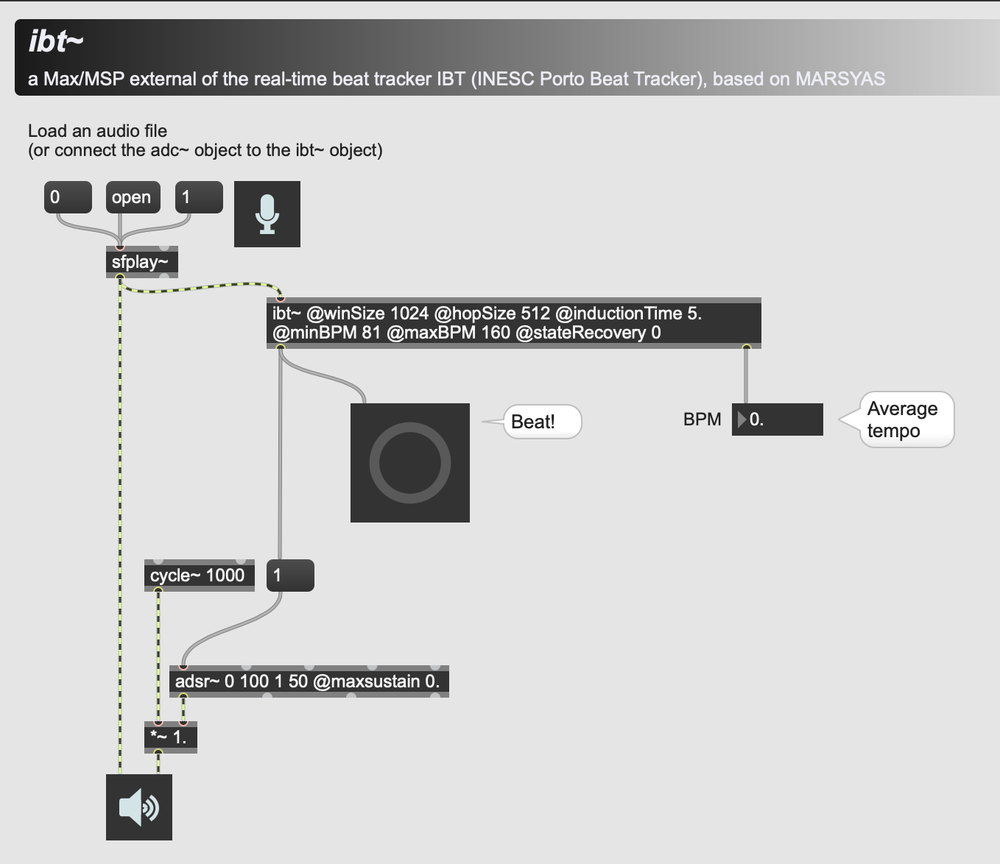

# ibt~ adaptive real-time beat tracking external object for Max/MSP
A beat tracking external for MaxMSP.  



Original source codes and project files are taken from: https://github.com/marsyas/marsyas/tree/master/src/marsyas_max-msp (Licensed under GPL)

```
João Lobato Oliveira, Fabien Gouyon, Luis Gustavo Martins, Luís Paulo Reis,
"IBT: A Real-time Tempo and Beat Tracking System." ISMIR 2010: 291-296
```
  
  
 
# Modification by @naotokui
- Compiled for Windows 64bit / Mac universal library
- Updated for the 64bit dsp chain of the latest Max/MSP SDK
  
  

# How to compile (work in progress)
- Install Marsyas: https://github.com/marsyas/marsyas/
	- Configure Marsyas compilation in cmake-gui
     Enable: WITH_MAX/MSP and MARSYAS_STATIC 
     Disable:  WITH_QT, WITH_MATLAB (if you don't have MATLAB installed) 

